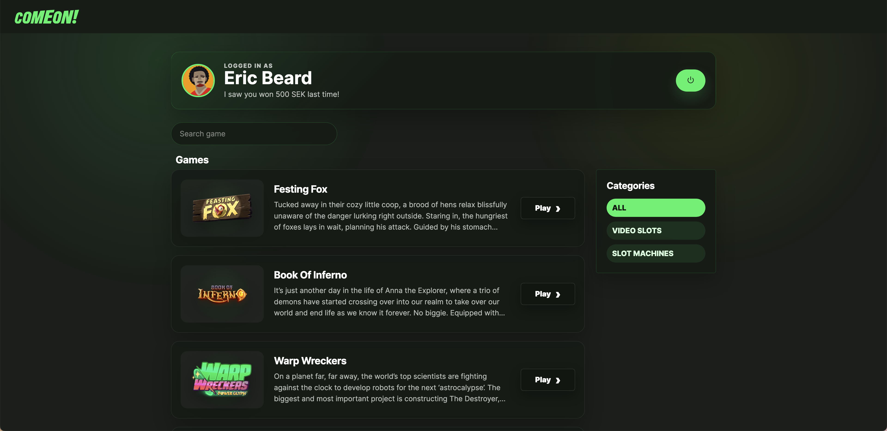

# comeon-frontend-test


A React + TypeScript casino lobby implementation for the ComeOn frontend assignment.

The app includes authentication against the provided mock API, protected lobby access, game listing, search and category filtering, game launch integration, responsive styling, unit tests, E2E tests, coverage, and Core Web Vitals instrumentation.

## Tech Stack

- React 18
- TypeScript
- Vite
- Zod
- Vitest
- Testing Library
- Playwright
- json-server
- Web Vitals
- ESLint

## Requirements

Use the Node version defined in `.nvmrc`.

```bash
nvm use
```

Install dependencies:

```bash
npm install
```

## Running The App

Start the mock API:

```bash
npm run mock:api
```

In a second terminal, start the frontend:

```bash
npm run dev
```

The app runs at:

```txt
http://localhost:5173
```

The mock API runs at:

```txt
http://localhost:3001
```

## Mock Login Accounts

```txt
username: rebecka
password: secret
```

```txt
username: eric
password: dad
```

```txt
username: stoffe
password: rock
```

## Available Scripts

### Development

```bash
npm run dev
```

Starts the Vite development server.

```bash
npm run mock:api
```

Starts the mock API using `json-server`.

### Build

```bash
npm run build
```

Runs TypeScript build checks and creates a production build.

```bash
npm run preview
```

Previews the production build locally.

### Code Quality

```bash
npm run typecheck
```

Runs TypeScript type checking.

```bash
npm run lint
```

Runs ESLint with zero warnings allowed.

```bash
npm run quality
```

Runs the full quality pipeline:

```bash
npm run typecheck && npm run lint && npm run test:coverage && npm run build
```

### Unit And Integration Tests

```bash
npm run test
```

Runs Vitest in watch mode.

```bash
npm run test:run
```

Runs all Vitest tests once.

```bash
npm run test:coverage
```

Runs tests with coverage reporting.

### E2E Tests

```bash
npm run e2e
```

Runs Playwright E2E tests.

```bash
npm run e2e:ui
```

Runs Playwright E2E tests in UI mode.

## Core Web Vitals

Core Web Vitals are tracked through the `web-vitals` package.

During development, metric results are logged in the browser console. To inspect them:

1. Start the app:

```bash
npm run dev
```

2. Open the browser DevTools.
3. Go to the `Console` tab.
4. Interact with the app and check the reported metrics.

Tracked metrics:

- CLS
- FCP
- INP
- LCP
- TTFB

The Web Vitals registration lives in:

```txt
src/reportWebVitals.ts
```


## Project Structure

```txt
src/
  api.ts
  App.tsx
  main.tsx
  reportWebVitals.ts
  components/
  features/
  test/
  types.ts
```

## Game Launch Integration

The game runtime script is loaded from `index.html` because it is provided as a standalone external script for the assignment.

Games are launched through the provided global API:

```ts
comeon.game.launch('feastingfox');
```

## Mock API

The mock API is powered by `json-server` and uses the provided mock data and middleware:

```bash
json-server --watch mock/mock-data.json --port 3001 --middlewares mock/mock-api.js
```

Use the project script instead of running this manually:

```bash
npm run mock:api
```
